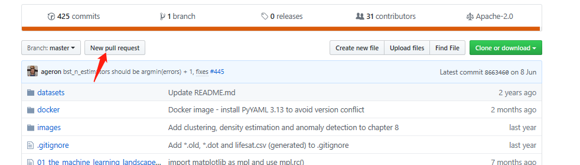
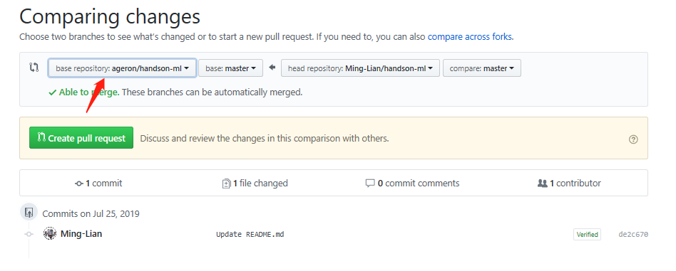

## 题目发布

<a name="content">目录</a>

- [项目说明](#introduction)
- [Q&A](#question-and-answer)
- [入门题](#for-beginer)
    - [1. RNA序列翻译成蛋白质](#for-beginer-1)
    - [2. 获得反向互补序列](#for-beginer-2)
    - [3. 根据序列ID，提取目标序列](#for-beginer-3)
    - [4. 双端未匹配数据的重新匹配](#for-beginer-4)
    - [5. 将输入的大Fasta文件拆分成若干个小Fasta文件](#for-beginer-5)
    - [6. 计算N50](#for-beginer-6)
    - [7. 计算测序深度(Coverage Depth)与覆盖度(Coverage Breadth)](#for-beginer-7)
    - [8. 生成长度为n的所有碱基序列](#for-beginer-8)
- [进阶题](#for-user-with-middle-level)
    - [1. 从Fastq文件中随机抽样一定量的数据](#for-user-with-middle-level-1)
    - [2. 将输入的大矩阵文件按照列拆分成若干个sub-matrixs文件](#for-user-with-middle-level-2)
    - [3. 将若干个单样本的表达定量结果汇总成一个大矩阵，即expression profile matrix](#for-user-with-middle-level-3)
    - [4. 根据samtools mpileup的输出，推断genotype](#for-user-with-middle-level-4)
    - [5. 根据给定的Motif代表序列集算出PWM矩阵](#for-user-with-middle-level-5)

- [挑战题](#for-veterans)
    - [1. 分层Bootstrap抽样](#for-veterans-1)
    - [2. 手写BWT](#for-veterans-2)
      - [2.1. Burrows-Wheeler Transformation](#for-veterans-2-1)
      - [2.2. BWT reverse transformation](#for-veterans-2-2)
      - [2.3. BWT search](#for-veterans-2-3)
      - [2.4. maximal exact matches (MEMs)](#for-veterans-2-4)
    - [3. 手写BLAST](#for-veterans-3)
    - [4. 手写de Bruijn](#for-veterans-4)
      - [4.1. 构建de Bruijn graph](#for-veterans-4-1)
      - [4.2. 搜索欧拉路径](#for-veterans-4-2)
    - [5. 相似数组搜索](#for-veterans-5)
    - [6. 从头实现后缀树的序列比对：从树构建到序列比对](#for-veterans-6)
    - [7. 手写samtools部分功能](#for-veterans-7)

<a name="introduction"><h2>项目说明 [<sup>目录</sup>](#content)</h2></a>

在IT圈中，LeetCode（中文名：力扣）是每一个程序猿修炼内功的闯关平台，几乎每一位程序员在顺利拿到IT大厂的offer之前，都被里面的各种数据结构与算法题虐过千百遍，但是正所谓不疯魔不成佛，每一个编程大牛都是在与一个一个编程任务和一个一个bug调试的斗争中逐渐成长起来的

与那些真正的动不动就写一个游戏，啪啪敲出成千上万行代码，而且还要考虑系统的稳健性和性能优越性的真程序猿相比，我们这些稍微懂点编程的生物狗，的确是一种非常辣鸡的存在

不过，也不要妄自菲薄，不是我们不行，而是我们工作生活中遇到的场景和他们不一样导致的，和他们相比，我们对系统的稳健性和性能优越性要求不高，基本上能把我要完成的数据分析任务搞定，那就是一个可行的编程解决方案，至于它的所谓时间复杂度与空间复杂度，不是需要我们考虑太多的东西，也没有所谓的用户或者产品经理给你提出比较尖酸刻薄的需求，没有压力，也就没有动力，所以慢慢的成了一条咸鱼

但是，只要你有一颗积极向上的心，只要还不想成为一个实验室的弱鸡搬砖人员，你的目标是星辰大海，既然外界不给咱们压力，那咱们就自己给自己造点压力——

<p align="center">朋友们，来接受编程的挑战吧</p>

<a name="question-and-answer"><h2>Q&A [<sup>目录</sup>](#content)</h2></a>

1. **对编程语言有什么要求？**

    理论上，不限定使用的编程语言，只要能够实现特定的功能即可

    虽然理论上对于某一特定的功能，不同的编程语言都能有实现的方案，不过每种编程语言都有各自的特点属性，为某一类编程场景而设计，因此在实现同一功能上效率有高低之分

    对于生信领域的从业人员来说，比较常用的是：Perl+Python+Shell+R，这几门语言的特点为：

    > - `Perl`：强大的纯文本处理能力，正则表达式功能强大，但缺点是不擅长数值计算；
    > - `Python`：一种在语法上最接近伪代码的高级语言，而且开发社区非常活跃，文本处理能力接近Perl，而且在使用`Numpy`和`pandas`模块后，具有了R中处理矩阵和数据框的能力，使用`matplotlib`模块后，具有了类似于R中用ggplot2绘图的能力——简而言之，`Python`≈`Perl`+`R`；
    > - `Shell`：直接与Linux内核打交道，所以在Linux命令行很实现的简单命令，组合一下就是一个Shell脚本，而且有一些比较简单但功能强大的文本处理命令，比如：`grep`、`sed`、`awk`、`cut`等；
    > - `R`：R就是专门为数值计算设计的，能够处理矩阵和数据框类型的数据结构，ggplot2能够将计算的结果进行友好的可视化展示——简而言之，R=计算+可视化；

    还有一个比较个人化的原因是：hub主目前会的编程语言基本就是这4门，所以给出来的示例代码就是用这4门语言编写的，建议大家拿这四门语言来完成这里的编程挑战

2. **怎么提交结果？怎么评估对错？**

    LeetCode是提供代码提交界面，而且运行提交的代码的后台服务器中运行，来得到运行结果，根据运行结果的对错，以及运行效率来给出打分

    but

    咱们没有这个条件，所以，我们会给出参考代码和测试数据，你可以用我们给出的参考代码处理我们给的测试数据得到参考结果，将你编程的代码处理得到的结果与参考结果进行比较（用md5sum命令，比较两个文件的md5值），若结果差不多，那基本上你编写的脚本就是没问题的了

    若你觉得你解决了某一个题目，欢迎将你的答案发到这个项目的issue里，让大家看看你的代码，若写得好，可以让大家学习学习，若有一些错误，也方便大家帮你挑出来

3. **可以提交题目吗？提交题目有什么要求？怎么提交？**

    当然了，而且非常欢迎，依据hub主的一己之力是不可能把这个项目办好的，毕竟自己精力有限，而且遇到的编程场景也比较有限

    我们对提交的题目的要求：

    > - 首先，得和生物信息数据分析场景有关系；
    > - 需要描述出你的问题，具体描述方式请参考目前已经给出的题目；
    > - 给出你的编程解决思路；
    > - 给出你的测试数据；
    > - 给出你的示例代码（请把注释信息写清楚，方便大家阅读你的代码）；

    最后就是提交方式了

    > - 首先，你要Fork一下咱们这个仓库
    >
    > 
    >
    > - 然后，直接在你Fork的那个分支仓库下编辑对应的文件
    >
    >    - 描述问题，请在`Questions.md`下编辑，需要给出测试数据的链接，并在这部分的结尾部分，附上定向到“编程解决思路”的链接；
    >    - 编程解决思路，请在`How2Deal.md`下编辑并在这部分的结尾部分，附上定向到“示例代码”的链接；
    >    - 测试数据，请提交到`Attachment`文件夹下；
    >    - 示例代码，请提交到`Answers`文件夹下；
    >
    > - 做好上面的编辑后，将其提交到主分支
    >
    >    点击提交按钮：
    >
    >    
    >
    >    设置你要提交到哪个目标分支上
    >
    >    
    >
    >    选择初始分支，即`base repository`
    >
    >    
    >
    >    最后，点击点击提交按钮，完成提交
    >
    >    
    >
    >    剩下的便是等待hub主的审核了

4. 无法查看github网页中的LaTex数学公式，怎么办？

    在Chrome浏览器中安装**MathJax Plugin for Github**插件后，再刷新网页就可以正常解析查看了

    由于在国内无法正常访问Chrome应用商店，所以在此之前请确保可以科学上网，可以通过手动安装[谷歌访问助手](https://github.com/Kenguba/google-access-helper)解决

<a name="for-beginer"><h2>入门题 [<sup>目录</sup>](#content)</h2></a>

<a name="for-beginer-1"><h3>1. RNA序列翻译成蛋白质 [<sup>目录</sup>](#content)</h3></a>

给定：氨基酸密码子表，和一个保存多条RNA序列的Fasta文件

任务：得到RNA序列翻译得到的氨基酸序列，保存为Fasta文件

<a name="for-beginer-2"><h3>2. 获得反向互补序列 [<sup>目录</sup>](#content)</h3></a>

给定：一条DNA序列

任务：得到这条DNA序列的反向互补序列

<a name="for-beginer-3"><h3>3. 根据序列ID，提取目标序列 [<sup>目录</sup>](#content)</h3></a>

根据序列ID，提取目标序列

给定：一个[fastq/fasta文件](./Attachments/R1.fastq)，以及另外一个保存目标序列的[id list文件](./Attachments/R1.interested.id)

任务：从fastq/fasta文件中，根据目标序列的ID，提取出目标序列保存为一个新的fastq/fasta文件

查看解题思路，[点这里](./How2Deal.md#for-beginer-3)

**友情提示**：请先尝试自行解决，然后再查看解题思路和示例代码

<a name="for-beginer-4"><h3>4. 双端未匹配数据的重新匹配 [<sup>目录</sup>](#content)</h3></a>

给定：一个样本的双端测序文件（Attachments文件夹下的R1.fastq和R2.fastq），且这双端Forward-end与Reverse-end同一行的序列并非如标准PE数据那样一一对应，即来源于同一个fragment

任务：只保留有双端序列的fragment，输出到处理后的双端Fastq文件，且让它在两个fastq文件的同一行一一对应

查看解题思路，[点这里](./How2Deal.md#for-beginer-4)

**友情提示**：请先尝试自行解决，然后再查看解题思路和示例代码

<a name="for-beginer-5"><h3>5. 将输入的大Fasta文件拆分成若干个小Fasta文件 [<sup>目录</sup>](#content)</h3></a>

给定：一个包含有大量序列的Fasta文件

任务：将该Fasta文件均匀拆分成若干个子Fasta文件，使得每个子文件中的序列条数相同（允许最后一个子文件的序列条数少一些），且提供两个拆分选项：

- 每个子文件的序列条数；
- 拆分得到的子文件的个数；

使得用户可以根据两个选项中的一个进行拆分

查看解题思路，[点这里](./How2Deal.md#for-beginer-5)

**友情提示**：请先尝试自行解决，然后再查看解题思路和示例代码

<a name="for-beginer-6"><h3>6. 计算N50 [<sup>目录</sup>](#content)</h3></a>

给定：包含多条contig的fasta文件

任务：计算这些contig的N50

> 解释：什么是N50？
> 
> N50是用来评估de novo assembly结果拼接质量好坏的一个常用指标，它表示将所有contig按照序列长度从大到小排序后，累加长度刚好超过总长度50%的那条contig的长度
> 
> 一般来说，一个de novo assembly结果拼接质量越好，每条contig的长度会更长，则其N50就会越大

查看解题思路，[点这里](./How2Deal.md#for-beginer-6)

**友情提示**：请先尝试自行解决，然后再查看解题思路和示例代码

<a name="for-beginer-7"><h3>7. 计算测序深度(Coverage Depth)与覆盖度(Coverage Breadth) [<sup>目录</sup>](#content)</h3></a>

给定：samtools mpileup的输出文件（Pileup格式）

> 文件形式如下图：
>
> <p align='center'></p>
>
> 其中，各列的含义为：
>
> | 列序号 | 列名 | 说明 |
> |:---|:---|:---|
> | 1 | Chromosome name | 参考序列的序列名 |
> | 2 | 1-based position on the chromosome | 该序列的碱基位置（1-base）|
> | 3 | Reference base at this position | 参考序列该碱基位置的碱基组成 |
> | 4 | Number of reads covering this position | 该碱基位置覆盖的reads数 |
> | 5 | Read bases | 覆盖该碱基位置的各碱基组成，其中 "." 和 "," 分别表示正负链的匹配，"ATCG" 和 "actg" 分别表示正负链的错配 |
> | 6 | Base qualities | 碱基测序质量 |
>
> 详细的格式说明，请查看[samtools官网](http://www.htslib.org/doc/samtools-mpileup.html)

任务：基于给定参考序列范围（可能有多条参考序列$s\in S$，假设正好为一个基因组）内的测序深度的分布$D(s, i)$（s表示参考序列， i表示该碱基位置的测序深度，$i\in [1, L_s]$）

- 计算全基因的平均测序深度

    $$D_{average}=\frac{\sum_{s\in S, i\in [1, L_s]}D(s,i)}{\sum_{s\in S}L_s}$$

- 计算对应各个测序深度d下的基因组区域比例：

    $$P(X=d)=\frac{\sharp\lbrace (s,i) \mid D(s,i)==d\rbrace}{\sharp\lbrace (s,i)\rbrace}$$

- 计算不超于测序深度d的基因组区域比例：

    $$P(X \le d)=\frac{\sharp\lbrace (s,i) \mid D(s,i)\le d\rbrace}{\sharp\lbrace (s,i)\rbrace}=\sum_{i=0}^{d}P(X=i)$$

查看解题思路，[点这里](./How2Deal.md#for-beginer-7)

**友情提示**：请先尝试自行解决，然后再查看解题思路和示例代码

<a name="for-beginer-8"><h3>8. 生成长度为n的所有碱基序列 [<sup>目录</sup>](#content)</h3></a>

生成长度为n的所有碱基序列，每个碱基位点的碱基组成可能为$\lbrace A, T, C, G\rbrace$

例如，当n=3时，所有可能的碱基序列为：

```
AAA
AAT
AAC
AAG
ATA
ATT
ATC
ATG
ACA
ACT
ACC
ACG
...
GGG
```

总共有$4^n$种可能

查看解题思路，[点这里](./How2Deal.md#for-beginer-8)

**友情提示**：请先尝试自行解决，然后再查看解题思路和示例代码

<a name="for-user-with-middle-level"><h2>进阶题 [<sup>目录</sup>](#content)</h2></a>

<a name="for-user-with-middle-level-1"><h3>1. 从Fastq文件中随机抽样一定量的数据 [<sup>目录</sup>](#content)</h3></a>

给定：双端FASTQ文件

任务：按照用户指定的数据量，即多少bp，从原始的双端FASTQ文件中随机抽取序列，要求双端FASTQ文件中的序列必须配对

要求：使用Perl、Python或R编写，从头实现，不允许调用现成的包或工具模块

查看解题思路，[点这里](./How2Deal.md#for-user-with-middle-level-1)

**友情提示**：请先尝试自行解决，然后再查看解题思路和示例代码

<a name="for-user-with-middle-level-2"><h3>2. 将输入的大矩阵文件按照列拆分成若干个sub-matrixs文件 [<sup>目录</sup>](#content)</h3></a>

给定：给定一个大矩阵，行是features（基因或转录本），列是样本

任务：将该大矩阵按照列均匀拆分成若干个子sub-matrixes，使得每个子文件中的列数相同（允许最后一个子文件的列数少一些），且提供两个拆分选项：

- 每个子文件的列数；
- 拆分得到的子文件的个数；

使得用户可以根据两个选项中的一个进行拆分

<a name="for-user-with-middle-level-3"><h3>3. 将若干个单样本的表达定量结果汇总成一个大矩阵，即expression profile matrix [<sup>目录</sup>](#content)</h3></a>

给定：保存在同一个文件夹下的若干个单样本的表达定量文件（[测试数据](./Attachments/Samples_profile.tar.gz)，请下载后请先用`tar zxvf`命令解压），即有n行2列，每一行表示一个基因/转录本的定量，第一列每个基因/转录本的ID，第二列是对应基因/转录本在该样本的定量值，且每个文件的命名形式为：`sample+suffix`，即`样本名+固定后缀`

| GeneID | Quant |
|:---:|:---:|
| g1 | 12 |
| g2 | 44 |
| ... | ... |

任务：将将若干个单样本的表达定量结果汇总成一个大矩阵

要求：使用Perl、Python或R编写，从头实现，不允许调用现成的包或工具模块

查看解题思路，[点这里](./How2Deal.md#for-user-with-middle-level-3)

<a name="for-veterans"><h2>挑战题 [<sup>目录</sup>](#content)</h2></a>

<a name="for-veterans-1"><h3>1. 分层Bootstrap抽样 [<sup>目录</sup>](#content)</h3></a>

<a name="for-veterans-2"><h3>2. 手写BWT [<sup>目录</sup>](#content)</h3></a>

<a name="for-veterans-2-1"><h4>2.1. Burrows-Wheeler Transformation [<sup>目录</sup>](#content)</h4></a>

给定：一条核酸序列，例如：TCATC

任务：将该序列经过BW转换（Burrows-Wheeler Transformation），得到BWT输出，或者称为BWT索引（BWT index）

<p align='center'></p>

<p align='center'>Burrows-Wheeler Transformation</p>

要求：使用Perl、Python或R编写，从头实现，不允许调用现成的包或工具模块

查看解题思路，[点这里](./How2Deal.md#for-veterans-2-1)

**友情提示**：请先尝试自行解决，然后再查看解题思路和示例代码

<a name="for-veterans-2-2"><h4>2.2. BWT reverse transformation [<sup>目录</sup>](#content)</h4></a>

给定：BWT output，以[2.1. Burrows-Wheeler Transformation](#for-veterans-2-1)的输出结果`CCTTA$`为例

任务：根据BWT output，还原出其原始的输入序列

实现BWT reverse transformation的方法有以下两种：

（1）方法一：

根据First Column(FC)与Last Column(LC)之间的存在的以下两种关系：

- FC与LC在同一行$i$的碱基，在参考序列中是一后一前紧挨着的关系

    利用这种关系，我们就可以某一个碱基的在参考序列的前一个碱基或者后一个碱基的组成

- 按照从上到下的计数方式，FC中第i次遇到的碱基a与LC中第i次遇到的碱基a，是参考序列中的同一个碱基，即它们在参考序列上对应于同一个碱基位置

    利用这种关系，我们可以FC（或LC）第i行碱基在LC（或FC）所对应的碱基的位置

那么，利用上面的两条性质，我们可以按照下面的方法实现BWT逆变换：

> 初始条件为：当前碱基位置index=0，即为FC的第一行，且当前碱基组成为base=\$，当前参考序列组成为T=\$
> 
> 循环执行下面的操作，直至当前碱基组成再一次为\$：
> 
> （1）回溯：获取LC同处于index行的碱基组成c，更新当前参考序列T=cT
> 
> （2）LC到FC的定位：获取LC处于index行的碱基c在FC对应的碱基的位置i，更新当前碱基位置index=i

<p align='center'></p>

（2）方法二：

根据BWT output逐列推出

<p align='center'></p>

通过构建出完整是BWT矩阵，来得到原始的输入序列

要求：使用Perl、Python或R编写，从头实现，不允许调用现成的包或工具模块

查看解题思路，[点这里](./How2Deal.md#for-veterans-2-2)

**友情提示**：请先尝试自行解决，然后再查看解题思路和示例代码

<a name="for-veterans-5"><h3>5. 相似数组搜索 [<sup>目录</sup>](#content)</h3></a>

给定：

> 从【[这里](https://github.com/Ming-Lian/Bioinfo_LeetCode/blob/master/Attachments/数组求相似.zip)】下载测试数据
>
> 数据有：
>
> - （1）P.txt文件，内含从小到大排序的1万个数组；
>
> - （2）S.txt文件，内含从小到大排序的1千个数组。
>
> 两个文件格式均为：（1）每个数组开始为`#00001`，也就是读到一行开始为`#`可以记为读到一个新数组。（2）小数点前有3到4位数字，小数点后有固定的5位数字。（3）以 `/n` 换行。示意如下：
>
> ```
> #00001
> 100.00001
> 100.10001
> ......
> 1999.00005
> #00002
> 100.00002
> 100.10002
> 1999.00006
> ……
> #10000
> 100.00010
> 100.10020
> ......
> 1999.00040
> ```

任务：

> 对于`S.txt`中的每一个数组，在`P.txt`中寻找“最相似”的数组，返回1千个编号（`P.txt`中的第几个数组）及“相似度”
>
> 每个结果占一行，以`\n`结尾，每行第一个数字为编号（一个整数），第二个数字为相似度（一个整数），中间用`\t`分隔，共1千行，存为`R.txt`。输入相同的`P.txt`和`S.txt`，不同人写的程序输出的`R.txt`应该是一模一样的。`R.txt`格式示意如下：
>
> ```
> 3282	288
> 4899	152
> 5814	124
> 4322	124
> ......
> ```

“相似”的定义：

> 两个数组里面有几个数字数值相差0.01以内
>
> 如 `S.txt` 中数组为 `[100,200,300]` ， `P.txt` 中数组为 `[200.00001,300.00001,1000]` ，这两个数组相似度为2。“最相似”即为数值相差0.01以内的数字最多
>
> 注意，`S.txt`和`P.txt`数组里的数字只能用于计算一次相似度，不能重复计数，找数值最相近的数字进行计数。如S.txt中数组为 `[200,300]` ， `P.txt` 中数组为 `[200.00001,200.00002,1000]` ，这两个数组相似度为1。

要求：使用Perl、Python或R编写，从头实现，不允许调用现成的包或工具模块

查看解题思路，[点这里](./How2Deal.md#for-veterans-4)

**友情提示**：请先尝试自行解决，然后再查看解题思路和示例代码
